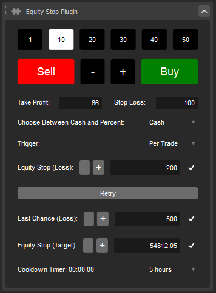

# Enhanced Equity Stop with Cooldown for cTrader
> A sophisticated modification of [Acronew's Equity Stop](https://ctrader.com/algos/show/4339/) with advanced features and improved UI.

## Overview
This enhanced version offers a streamlined interface with consolidated components and additional features for better trade management. The UI has been optimized by grouping related components together, resulting in a more efficient use of space.

## Key Features

### 🎯 Automated Risk Management
- **Auto Stop Loss & Take Profit**
  - Default protective measures: 150 pips stop loss and 100 pips take profit
  - Configurable: Can be adjusted by dragging to desired levels during active trades
  - Optional: Can be disabled via checkbox

### 💹 Position Management
- **Dynamic Position Sizing**
  - Multiplier buttons: 10x, 20x, 30x, 40x, 50x
  - Example: With base lot size 10 and 50x multiplier, creates additional 40 lots market order
  - Increase/Decrease buttons for base lot size (supports martingale strategy)
  - Direct Buy/Sell execution at selected lot size

### 🔄 Retry Mechanism
- Allows re-entry after initial equity stop loss
- Automatically adjusts profit target to account for previous losses
- Trading restricted once last chance threshold is reached
- Trading resumes after cooldown period

### ⏲️ Cooldown System
- **Features**
  - Customizable cooldown duration
  - Automatic closure of active trades during cooldown
  - Persistent timer (continues even after application restart)
  - Saved settings across sessions
  - Triggered by equity stop (loss or target)

### 🎚️ Trigger Modes

#### 1. Per Trade Mode
- Individual trade monitoring
- Triggers when single trade loss exceeds equity stop value
- **Example Scenario:**
  - Equity Stop: 20
  - Single trade loss: 25
  - Result: Triggers cooldown, halts trading

#### 2. Per Session Mode
- Monitors cumulative session performance
- Considers total PnL across all trades
- **Example Scenario:**
  - Multiple trades: -10, -5, -7 (Total: -22)
  - Equity Stop: 20
  - Result: Triggers cooldown when total PnL exceeds threshold

## Technical Notes
- Optimized for "USTEC" instrument (configurable)
- Stop Loss and Take Profit measured in pips
- Settings persistence across sessions

## Known Issues
**Cooldown Reset Bug:**
- During cooldown: Trading halted for entire session
- Issue: Timer incorrectly restarts after completion
- Workaround: Start new session after cooldown
- Resolution: Timer functions normally in new session