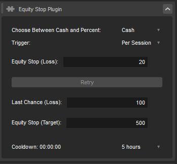

# A Modification of [Acronew's Equity Stop](https://ctrader.com/algos/show/4339/)

Removed "Reset Equity" button.
Rearranged the form to make related components stay in the same row as opposed to several columns which take up space.

New:
- Retry
  - If you get stopped out on your initial defense, the equity stop, you may choose to retry. However, once you reach the last chance threshold, no further retries are allowed for the rest of the session. You can resume trading once the cooldown period ends.
- Cooldown Timer
  - Allows to select how long cooldown would last.
  - Automatically closes active trades while cooling down to prevent further trades.
  - Is only triggered when equity stop of either loss or target.
  - The cooldown timer will persist even if you close the app. It will count the timer correctly even when you reopen cTrader.
  - Settings will also be saved.
- Trigger (Both triggers cooldown)
  - Per Trade
    - Equity stops will be triggered per trade. If your Equity Stop input is 20, and your profit goes -20, you will get stopped out.
    - Scenario:
      - You set your Equity Stop to 20. You place a trade aiming for a profit, but the market moves against you, and you experience a loss of 25 on this single trade. Because this single trade loss exceeds your Equity Stop input of 20, the system halts trading and initiates a cooldown period. During this cooldown, no new trades can be executed, regardless of the outcome of other trades or any accumulated losses. Trading can resume after cooldown.
  - Per Session
    - This setting monitors the cumulative results of all trades within a session. If the total losses from all trades during the session reach or exceed the Equity Stop input, the system stops trading and activates the cooldown. No further trades can be placed during that session once the equity stop is triggered.
    - Scenario:
      -  You place multiple trades in a session. The first trade loses 10, the second loses 5, and the third loses 7, totaling 22 in losses. If your Equity Stop input is 20, the system will check the overall sum of PnL for the session, not just the losses. If the total sum of PnL (including any profits) goes below the Equity Stop input threshold, the system will stop trading for the rest of the session and trigger the cooldown.
     -  Bug: During a cooldown period, trading is completely halted for the entire session, and you cannot place any orders. When the cooldown period ends, it erroneously restarts the countdown, preventing you from resuming trades until the cooldown finishes again. To place orders, you need to start a new session. Once the cooldown period is complete in the new session, it will not restart, and you can resume trading as usual.